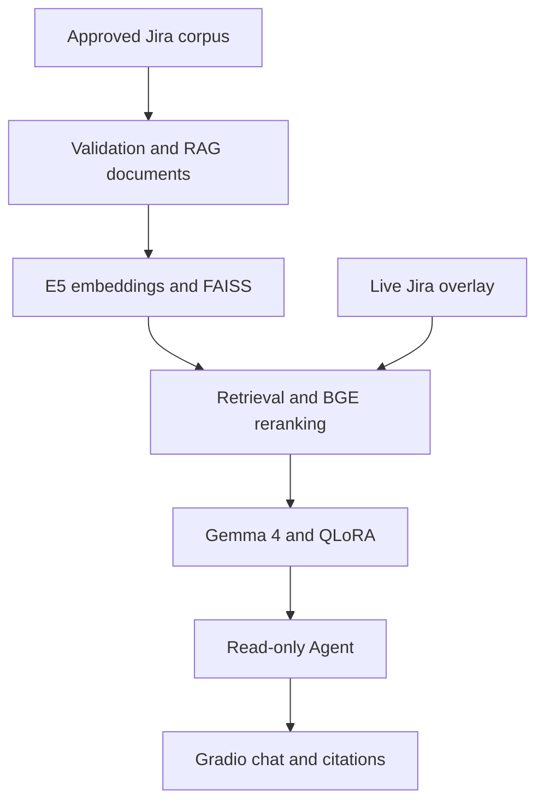

# 🎫 jiRAG — Jira Retrieval-Augmented Generation Assistant

[](https://colab.research.google.com/drive/1r_cEVbmhRfOfjKQ_d021mrV7Zcip_c0u?usp=sharing)
[](https://github.com/Sagitb/rag_project_google_reichman)
[](https://github.com/Ouriel91/ai-deep-learning-course/tree/main/project_03_jiRAG)

<!-- Replace the article and presentation placeholders after those files are uploaded. -->

`jiRAG` is an end-to-end Retrieval-Augmented Generation system over an approved corpus of **1,000 anonymized Jira-style tickets**. It combines validated data preparation, multilingual semantic retrieval, a persistent FAISS vector store, cross-encoder reranking, grounded generation with Gemma 4, QLoRA fine-tuning, a read-only Agent, incremental Jira synchronization and a manager-facing Gradio chat.

The system answers questions about incidents, causes, resolutions and validation evidence while returning traceable citations such as `[tckt-0186]`. It also supports exact lookup, filtering, aggregation and hybrid retrieval, and is designed to abstain when the supplied Jira evidence is insufficient.

---

# 👥 Team Members

- **Ouriel**
- **Ilya**
- **Sagi**

---

# 📌 Project Highlights

- Validated and versioned corpus of 1,000 tickets
- Leakage-safe 750 / 150 / 100 Train, Validation and Test split
- Controlled comparison of three embedding models
- Persistent FAISS database with multilingual E5 embeddings
- Exact, semantic, filtered, aggregate and hybrid retrieval
- BGE cross-encoder reranking and versioned prompts
- Grounded Gemma 4 generation with ticket citations
- Two controlled QLoRA experiments
- Frozen 44-question benchmark and 2×2 ablation
- Read-only Agent with evidence and workflow guardrails
- Incremental Jira ingestion through a separate live overlay
- Interactive Gradio chat with explicit synchronization

---

# 🎯 Objectives

Operational teams may have hundreds or thousands of historical Jira tickets, but locating the relevant incident is difficult when symptoms and wording differ. jiRAG is designed to:

- Retrieve incidents by meaning rather than exact keywords.
- Explain what happened, why it happened and whether it was resolved.
- Distinguish verified, partial, workaround and unresolved outcomes.
- Cite the tickets supporting each answer.
- Refuse unsupported claims instead of relying on general model knowledge.
- Answer exact counts and metadata-constrained questions.
- Offer human-reviewed recommendations without changing Jira.
- Ingest new Jira issues without modifying the frozen research corpus.

---

# 🏗️ Architecture



The 1,000-ticket corpus remains immutable during Evaluation and live demonstrations. Jira Cloud issues are stored in a separate live FAISS overlay; static and live candidates are merged and reranked before grounded generation.

---

# 📊 Dataset

The approved corpus contains 1,000 anonymized Jira-style tickets across ten technical families. Each ticket includes operational context, the reported issue, investigation findings, resolution and validation evidence.

| Property | Value |
|---|---:|
| Tickets | 1,000 |
| Technical families | 10 |
| Solution types | 4 |
| Done tickets | 641 |
| Open tickets | 359 |
| High or Highest priority | 405 |

| Solution type | Tickets |
|---|---:|
| Verified | 550 |
| Partial | 150 |
| Workaround | 150 |
| Unresolved | 150 |

The pipeline validates the schema, categorical values, description structure, ticket-ID uniqueness, family coverage and canonical fingerprint. The approved raw CSV remains unchanged; normalized data and QA artifacts are generated separately.

---

# 🔀 Leakage-Safe Split

| Split | Ratio | Tickets | Purpose |
|---|---:|---:|---|
| Train | 75% | 750 | QLoRA data and development |
| Validation | 15% | 150 | System and adapter selection |
| Test | 10% | 100 | Protected final evidence pool |

The split uses seed `42` and stratifies by `family × solution_type`. All 40 combinations are retained, IDs are pairwise disjoint and Test is frozen before final Evaluation.

---

# 🧾 Canonical RAG Documents

Each ticket becomes one deterministic document with separate boundaries for:

- **Search text:** Summary, Component and Description
- **Answer content:** approved ticket fields supplied to Gemma
- **Operational metadata:** Status, Priority and Work Type
- **Evaluation metadata:** family, solution type and split provenance

Evaluation labels are excluded from embeddings and generation context, preventing expected experimental outcomes from leaking into model input.

---

# 🔎 Embeddings and FAISS

Three models were compared on a balanced Train-only pilot of 80 documents and 22 reviewed questions (16 English and six Hebrew).

| Model | Overall Hit@1 | English Hit@1 | Hebrew Hit@1 | MRR |
|---|---:|---:|---:|---:|
| BGE base English v1.5 | 68.2% | 93.8% | 0.0% | 0.784 |
| Nomic Embed Text v1.5 | 68.2% | 87.5% | 16.7% | 0.742 |
| **Multilingual E5 base** | **90.9%** | **93.8%** | **83.3%** | **0.955** |

Selected model:

```text
intfloat/multilingual-e5-base
```

| Vector-store parameter | Value |
|---|---|
| Documents | 1,000 |
| Dimensions | 768 |
| Data type | `float32` |
| Normalization | Enabled |
| FAISS index | `IndexFlatIP` |
| Similarity | Normalized inner product (cosine-equivalent) |
| Prefixes | `query:` / `passage:` |

The index, embedding matrix, ID mapping and lineage manifest are saved to Drive and validated before reuse.

---

# 🧭 Retrieval and Reranking

jiRAG supports exact lookup, semantic search, metadata filtering, deterministic aggregation, hybrid search and new-ticket similarity search.

The improved RAG path retrieves ten E5 candidates and reranks them with `BAAI/bge-reranker-v2-m3` using batch size 16 and maximum length 512. The best five documents become generation evidence.

---

# 🧠 Gemma 4 and Prompt Engineering

Generation uses:

```text
google/gemma-4-E4B-it
```

| Parameter | Value |
|---|---:|
| Maximum input tokens | 12,000 |
| Maximum generated tokens | 320 |
| Sampling | Disabled |
| Decoding | Deterministic |
| Baseline prompt | `basic_grounded_rag_v2_no_gold_labels` |
| Improved prompt | `improved_grounded_rag_v3` |

The prompt requires evidence-based answers, local citations, separation of similar incidents, calibrated resolution language and explicit uncertainty. Internal Evaluation labels, retrieval scores and source ranks are not supplied to the model.

---

# ⚙️ QLoRA Fine-Tuning

Gemma is loaded with 4-bit NF4 double quantization. The base model remains frozen while low-rank adapters are trained.

| Training parameter | Value |
|---|---:|
| Maximum sequence length | 4,096 |
| Epochs | 2 |
| Learning rate | `2e-4` |
| Per-device batch size | 1 |
| Gradient accumulation | 4 |
| Effective batch size | 4 |
| Optimizer | `paged_adamw_8bit` |
| Scheduler | Cosine |
| Warmup | 3% |
| LoRA dropout | 0.05 |
| Gradient checkpointing | Enabled |
| Seed | 42 |

| Experiment | Rank | Alpha |
|---|---:|---:|
| `qlora_r8` | 8 | 16 |
| `qlora_r16` | 16 | 32 |

Training uses 750 single-source examples plus small multi-source and no-answer supplements. Prompt and padding tokens are masked from supervised loss, and silent truncation is prohibited. The adapters tied on protected Validation criteria, so `qlora_r8` was selected for efficiency. Test was not used for selection.

---

# 🧪 Evaluation

The fixed benchmark contains 44 manually reviewed questions:

| Benchmark | Total | Single-ticket | Multi-ticket | No-answer |
|---|---:|---:|---:|---:|
| Validation | 24 | 20 | 2 | 2 |
| Test | 20 | 16 | 2 | 2 |

Eight questions are in Hebrew. Validation selects retrieval, prompts and the QLoRA adapter. Test is evaluated only after the complete system identity is frozen.

Metrics include Hit@1/5, Recall@5, Complete@5, MRR@5, expected-point coverage, citation precision and recall, invalid citation rate, language match, no-answer abstention and ROUGE-L.

---

# 📈 Results and 2×2 Ablation

| System | Expected-point coverage | Gold citation recall | No-answer abstention | ROUGE-L |
|---|---:|---:|---:|---:|
| Base — No RAG | 0.9722 | 0.0000 | 1.0000 | 0.1179 |
| Base + RAG | 0.9861 | 0.9722 | 1.0000 | 0.2619 |
| QLoRA — No RAG | 0.7222 | 0.0000 | 1.0000 | 0.0578 |
| **QLoRA + RAG** | **1.0000** | 0.9444 | 0.0000 | **0.3209** |

The ablation shows that **RAG is the grounding mechanism**. Without retrieved evidence, both generators may produce unsupported text or invented ticket IDs. QLoRA improves the completeness and presentation of supported evidence but does not replace retrieval.

`QLoRA + RAG` is the primary answer path because it achieved complete expected-point coverage, perfect local citation precision and the highest ROUGE-L. The choice remains conditional: Base + RAG was safer on unsupported questions and retained more evidence in the small multi-source slice.

---

# 🤖 Read-Only Agent

The Agent selects the appropriate read route, checks evidence sufficiency and adds advice when appropriate. Safety boundaries include:

- Jira workflow changes are never executed automatically.
- Recommendations require human review.
- Exact counts remain deterministic.
- Citations are restricted to supplied evidence.
- Unsupported claims should lead to abstention.
- Historical incidents are investigation leads, not proof of a new report's cause.

The harness achieved 100% on its predefined routing, evidence, citation, advisory and no-write assertions. This is not a perfect language-quality score; manual inspection still found occasional status-phrasing inconsistencies.

---

# 🔄 Live Jira Synchronization

The optional Jira extension synchronizes up to 50 issues carrying:

```text
jirag-demo
```

Jira key and content fingerprint classify each issue as `NEW`, `UPDATED`, `UNCHANGED` or `REMOVED`. Only new or changed documents are encoded. The live overlay does not alter the frozen corpus or Evaluation results, and the application does not close or transition Jira issues.

---

# 💬 Gradio Demo

The final section launches a chat with a source table, synchronized-issue table, explicit **Sync Jira now** action and **Clear** action for independent contexts. The public share URL is temporary and exists only while the Colab runtime and tunnel remain active. A permanent application should use stable hosting and an authenticated API.

---

# 📂 Repository Structure

```text
.
├── jiRAG.ipynb
├── README.md
├── requirements.txt
├── data/
│   └── raw/
├── configs/
│   ├── evaluation/
│   ├── prompts/
│   └── *.json
└── src/
    └── jirag/
```

The repository contains source code, contracts, prompts, the approved raw dataset and the notebook. Generated data, splits, embeddings, indexes, reports, checkpoints and adapters are stored under:

```text
MyDrive/jiRAG/artifacts/
```

---

# 🚀 Getting Started

## 1. Clone or open the project

Choose one of the following options:

- Clone the repository:

```bash
git clone https://github.com/Sagitb/rag_project_google_reichman.git
```

- Or open the notebook directly in Google Colab using the **Open in Colab** link at the top of this README.

In both cases, the project is executed from the `jiRAG.ipynb` notebook.

## 2. Select a GPU and mount Drive

Gemma generation and QLoRA require CUDA. Section 0 mounts Google Drive, initializes the persistent artifact folders and pulls the repository files required by the notebook.

## 3. Configure Colab Secrets

For Hugging Face access:

```text
HF_TOKEN
```

`HF_TOKEN` is optional but recommended for authenticated Hugging Face access, higher download limits and models that may require accepted access terms.

For Jira integration:

```text
JIRA_BASE_URL
JIRA_EMAIL
JIRA_API_TOKEN
JIRA_PROJECT_KEY
```

Never store secret values directly in the notebook, Git repository or saved outputs.

## 4. Run the workflow

Run the cells in `jiRAG.ipynb` in order, or select **Runtime → Run all** for the first complete execution.

On later executions, compatible artifacts can be loaded automatically. To reopen only the saved demo, you may run the required sections instead of repeating the QLoRA training and evaluation stages.

> **Important:** Always run the project through `jiRAG.ipynb`, whether you cloned the repository or opened it directly through the Colab link.

> **Live Jira demo:** Create or update an issue with the `jirag-demo` label, then click **Sync Jira now**. The issue becomes searchable without rebuilding the frozen index.

---

# 📦 Dependencies

Main libraries include PyTorch, Transformers, Accelerate, PEFT, BitsAndBytes, Sentence Transformers, FAISS, NumPy, Pandas, Scikit-learn, Matplotlib, Seaborn, ROUGE Score, Gradio and Requests.

PyTorch is intentionally omitted from `requirements.txt` because Colab supplies a CUDA-compatible build.

---

# 🖥️ Hardware Scope

The complete recorded pipeline was executed successfully on an NVIDIA A100 40GB GPU. Compatibility was not benchmarked systematically across other accelerators.

4-bit NF4 quantization, batch size 1, gradient accumulation and gradient checkpointing reduce memory requirements. Parts—or potentially all—of the workflow may run on other GPUs. End-to-end execution on a 16GB T4 was not verified and may encounter GPU-memory limits, particularly during QLoRA training or when several models are loaded together.

---

# ⚠️ Limitations

- English generation is more consistent than Hebrew generation.
- Ambiguous follow-ups may lose the intended ticket context.
- Misspelled intent words may reduce routing accuracy.
- Similar incidents can compete when a query lacks distinctive terms.
- The selected QLoRA adapter was weaker on the small no-answer and multi-source slices.
- An irrelevant retrieved ticket may occasionally remain cited in an abstention.
- Gradio sharing is temporary rather than production hosting.
- Jira synchronization is a controlled POC integration.

Later Gradio observations were treated as exploratory debugging rather than a new benchmark. They did not reopen Test or change the reported Test metrics.

---

# 🔮 Future Work

- Stronger multilingual generation and spelling-tolerant routing
- An entailment or evidence-judge model
- Stronger multi-source checks
- More robust conversational state
- Role-based access control and audit logging
- Stable hosting with an authenticated API
- Broader human Evaluation on live organizational questions

---

# 🙏 Acknowledgments

This project was completed as part of an **AI and Deep Learning** course associated with **Google and Reichman University**.

The implementation builds on Google Gemma, Hugging Face Transformers and PEFT, Sentence Transformers, FAISS, Gradio and the wider open-source machine-learning ecosystem.
